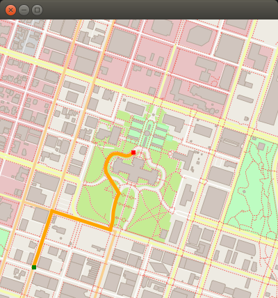

#**Udacity project**
##**CppNdRoutePlanningProject**

**_The first project of Udacity nanodegree._**

A 2D map, which can be used to create a route planner plotting a path between two points on a map, is expected to be made in this project. The information extracted from the OpenStreeMap project is the database of the map. The final output should look like the image below:


The project is written in C++, using real map and A-star search algorithms. The OpenStreetMap project is an open-source, collaborative endeavor to create free, user-generated maps of every part of the world. These maps are similar to the maps you might use in Google Maps or the Apple Maps app on your phone, but they are completely generated by individuals who volunteer to perform ground surveys of their local environment.

##Instruction
The project required dependencies such as CMake, VScode, and g++ in your local environment. 
To build the code, make the **_build_** directory into the project by `mkdir build` and then `cd` into that directory. 
The following command is necessary to run the code
`cmake..` and `make`.
Once the project is built, run the excutable binary file to display the map 
`./OSM_A_star_search`

##Testing

For exercises that have unit tests, the project must be built with the approprate test cpp file. This can be done by passing a string with the `-DTESTING` flag in `cmake`. For example, from the build directory:
```
cmake -DTESTING="RouteModel" ..
make
```
Those commands will build the code with the tests for the "Fill Out Route Model" exercise. The tests can then be run from the `build` directory as follows:
```
../bin/test
```

